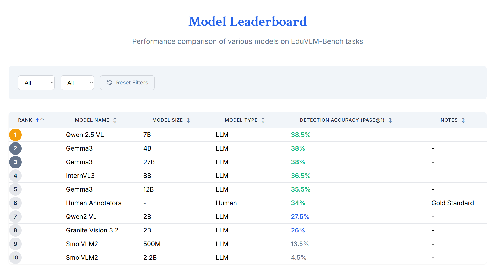

# EduVLM-Bench: A Multimodal Benchmark for Educational Concept Learning

🎯 **Project Overview**

**EduVLM-Bench** is a comprehensive benchmark designed to evaluate Vision-Language Models (VLMs) on educational concept prerequisite identification. The core problem we're addressing is: *When a student fails to answer a question correctly, how can we identify the missing prerequisites that will help bridge the gap from confusion to correct understanding?*

## Key Innovation

Rather than just evaluating whether models can solve problems, we focus on **diagnostic capability** - can models identify what knowledge is missing when learning breaks down?

## 🎓 Research Vision

This project aims to create a framework that can:
* **Identify Missing Prerequisites**: Given a student's wrong answer, pinpoint specific knowledge gaps
* **Generate Learning Paths**: Provide structured pathways from current understanding to mastery
* **Support Multimodal Reasoning**: Evaluate both text-only and image-based mathematical problems
* **Benchmark VLM Performance**: Evaluate models across different scales (2B to 27B parameters) and architectures
* **Enable Crowdsourced Annotation**: Streamline human evaluation through web-based annotation tools

## 🏗️ Project Structure

```
EduVLM-Bench/
├── annotator_app/              # Legacy annotation tool (June 18)
├── eduvlm-app-main/           # Main web application code
├── error-generation.ipynb     # Wrong answer generation pipeline
├── gsm8_concepts_retry.py     # Concept extraction utilities
├── gsm8k_concept.py          # Core concept processing
├── gsm8k_prerequisite.py     # Prerequisite identification
├── gsm8k_unique_concepts.csv # Cleaned concept taxonomy (46 unique concepts)
├── gsm8k_wrong_answers_*.json # Generated wrong answers with prerequisites
├── gui_annotator.py          # GUI-based annotation interface
├── human_annotations.csv     # Human evaluation data
├── llm_predictions.py        # Model inference pipeline
└── task2_llm_pipeline_llama.ipynb # Model evaluation notebook
```

## 📊 Current Progress & Results

### ✅ **Phase 1: Dataset Development (COMPLETED)**

## 🏗️ Framework Architecture

.png)

*Overview of the EduVLM-Bench framework showing the complete pipeline from problem input through prerequisite detection and evaluation.*

- **Unimodal Dataset**: GSM-8K first 200 questions with comprehensive prerequisite mapping
- **Multimodal Dataset**: DrawEduMath integration with visual mathematical reasoning
- **Concept Taxonomy**: Refined from 71 to 46 unique mathematical concepts
- **Wrong Answer Generation**: Gemini 2.0 Flash + Gemma3 4B pipeline

### ✅ **Phase 2: Model Evaluation (COMPLETED)**
Comprehensive evaluation across 9 state-of-the-art models:

## 📊 Model Performance Leaderboard



*Comprehensive evaluation results across 9 state-of-the-art vision-language models on the EduVLM-Bench prerequisite detection task.*

### ✅ **Phase 3: Web Platform (COMPLETED)**
- **Live Demo**: Fully deployed web application with Gemini 1.5 Flash integration
- **Multimodal Support**: Both text-only and image-based problem evaluation
- **Admin Panel**: Comprehensive annotation management and report generation
- **User Authentication**: MongoDB-based login system for crowdsourced annotation
- **Responsive Design**: Mobile-optimized interface with dynamic leaderboards

## 🔬 **Evaluation Metrics**

### Traditional Metrics
- **Pass@1 Accuracy**: Binary correctness evaluation
- **BERT Score**: Semantic similarity measurement
- **BLEU/METEOR**: Text similarity assessment

### Novel Taxonomic Distance Metrics
- **BFS-based Average Taxonomic Distance (ATD)**: Simple shortest-path measurement (0-3 scale)
- **Resnik-based Weighted Taxonomic Distance**: Information content using Least Common Ancestor (0-1 scale)

## 🌐 **Web Platform Features**

### For Researchers
- **Interactive Demo**: Real-time prerequisite detection using Gemini 1.5 Flash
- **Leaderboard**: Comprehensive model performance comparison
- **Dataset Download**: Access to complete benchmark datasets
- **Citation Generation**: Automated academic citation tools

### For Annotators
- **Multimodal Interface**: Support for both GSM-8K and DrawEduMath datasets
- **Progress Tracking**: Individual and team annotation progress monitoring
- **Quality Control**: Built-in validation and consistency checks

### For Administrators
- **Annotation Management**: Comprehensive oversight of crowdsourced data
- **Report Generation**: Automated dataset quality analysis
- **User Management**: Role-based access control

## 🚀 **Key Achievements**

1. **Comprehensive Benchmark**: First multimodal benchmark for educational prerequisite detection
2. **Model Saturation Discovery**: Identified 36-38% accuracy plateau across state-of-the-art VLMs
3. **Novel Evaluation Framework**: Development of taxonomic distance metrics for educational assessment
4. **Production-Ready Platform**: Fully deployed web application with crowdsourcing capabilities
5. **Academic Impact**: Research findings ready for publication submission

## 🔧 **Technical Stack**

- **Backend**: Python Flask API with Gemini integration
- **Frontend**: HTML/CSS/JavaScript with Tailwind CSS
- **Database**: MongoDB for user authentication and annotation storage
- **Deployment**: Render platform with local backup capabilities
- **Models**: Integration with Gemini 1.5 Flash, Gemma3, Qwen, InternVL3, and others

## 📈 **Impact & Insights**

### Research Findings
- **Model Limitations**: Current VLMs struggle with educational diagnostic reasoning
- **Scale vs Performance**: Larger models don't necessarily perform better on prerequisite detection
- **Human-AI Gap**: Significant gap between human educational intuition and model performance

### Educational Applications
- **Personalized Learning**: Framework for identifying individual student knowledge gaps
- **Curriculum Design**: Data-driven approach to prerequisite sequencing
- **Assessment Innovation**: Moving beyond correctness to understanding learning pathways

## 🎯 **Future Directions**

- **Extended Evaluation**: Scaling to larger datasets and additional subjects
- **Improved Metrics**: Development of more sophisticated educational evaluation measures
- **Real-world Deployment**: Integration with existing educational platforms
- **Cross-cultural Validation**: Evaluation across different educational contexts

## 📄 **Citation**

```bibtex
@misc{eduvlmbench2025,
  title={EduVLM-Bench: A Multimodal Benchmark for Educational Concept Learning},
  author={Team T11},
  year={2025},
  institution={IIT Ropar DLED Lab},
  note={IASc Summer Research Fellowship}
}
```

---

**Developed by Team T11 under the IASc Summer Research Fellowship program at IIT Ropar's DLED Lab**
